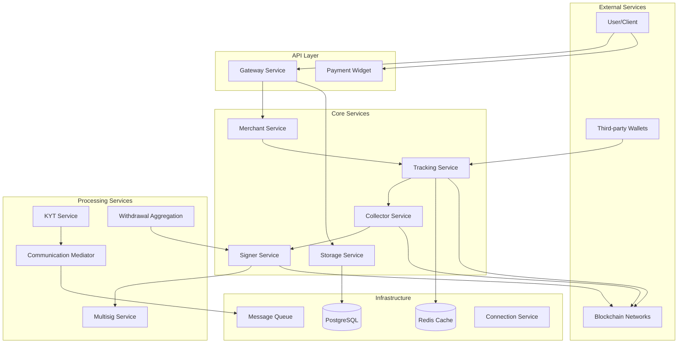

# Architecture Overview

The Crypto Payment Gateway is built using a microservices architecture with modular components that handle different aspects of cryptocurrency payment processing.

## System Architecture

## Core Components

### Applications (`/apps`)

#### Gateway Service
- **Purpose**: Main API endpoint for external integrations
- **Responsibilities**: 
  - REST API endpoints
  - Request validation and routing
  - Authentication and authorization
  - Rate limiting

#### Merchant Service  
- **Purpose**: Business logic for merchant operations
- **Responsibilities**:
  - Merchant account management
  - Payment processing logic
  - Balance calculations
  - Transaction history

#### Storage Service
- **Purpose**: Data persistence and retrieval
- **Responsibilities**:
  - Database operations
  - Data validation
  - Transaction logging
  - Balance updates

#### Tracking Service
- **Purpose**: Blockchain transaction monitoring
- **Responsibilities**:
  - Block scanning
  - Transaction detection
  - Address monitoring
  - Event emission

#### Collector Service
- **Purpose**: Token collection from user addresses
- **Responsibilities**:
  - Token sweeping
  - Gas fee management
  - Collection scheduling
  - Multi-signature coordination

#### Signer Service
- **Purpose**: Transaction signing and broadcasting
- **Responsibilities**:
  - Private key management
  - Transaction signing
  - Broadcast coordination
  - Security validation

#### Multisig Service
- **Purpose**: Multi-signature wallet operations
- **Responsibilities**:
  - Multi-sig transaction creation
  - Signature collection
  - Threshold validation
  - Security enforcement

#### KYT (Know Your Transaction)
- **Purpose**: Transaction compliance and monitoring
- **Responsibilities**:
  - AML/KYC compliance
  - Risk assessment
  - Suspicious activity detection
  - Regulatory reporting

#### Withdrawal Aggregation
- **Purpose**: Optimized batch withdrawals
- **Responsibilities**:
  - Withdrawal batching
  - Fee optimization
  - Timing coordination
  - Status management

#### Communication Mediator
- **Purpose**: Inter-service communication
- **Responsibilities**:
  - Message routing
  - Event distribution
  - Service coordination
  - Error handling

#### Connection Service
- **Purpose**: External service connections
- **Responsibilities**:
  - RPC connections
  - Connection pooling
  - Failover handling
  - Health monitoring

#### Widget
- **Purpose**: Frontend payment interface
- **Responsibilities**:
  - Payment UI
  - QR code generation
  - Status updates
  - User interaction

### Packages (`/packages`)

#### Blockchain Clients
- **bc-client**: Generic blockchain client interface
- **bc-client-provider**: Client provider factory
- **bitcoin**: Bitcoin-specific operations
- **ether**: Ethereum-compatible operations  
- **tron**: Tron network operations

#### Infrastructure
- **amqp**: RabbitMQ messaging
- **cache-manager**: Redis caching
- **config**: Configuration management
- **logger**: Logging utilities
- **typeorm**: Database ORM extensions

#### Business Logic
- **addresses**: Address management
- **currency-rates**: Exchange rate handling
- **distributor**: Fund distribution
- **payer**: Payment processing
- **tracker**: Transaction tracking

#### Utilities
- **common**: Shared utilities
- **encoder**: Data encoding/decoding
- **helpers**: Helper functions
- **http-client**: HTTP client utilities
- **io-emitter**: Event emission
- **provider**: Service providers
- **rpc**: RPC communication
- **testing**: Testing utilities

## Data Flow

### Deposit Flow
1. User sends cryptocurrency to generated address
2. **Tracking Service** detects incoming transaction
3. **Storage Service** updates balance records
4. **Collector Service** sweeps tokens to collection wallet
5. **Merchant Service** processes business logic
6. **Communication Mediator** sends notifications

### Withdrawal Flow
1. **Gateway** receives withdrawal request
2. **Merchant Service** validates request and balance
3. **Withdrawal Aggregation** batches requests (if enabled)
4. **Signer Service** creates and signs transaction
5. **Multisig Service** handles multi-signature requirements
6. **Storage Service** updates balances and status
7. **Communication Mediator** sends confirmation

## Address Types and Ownership

### User Addresses (Default)
- **Purpose**: Receive deposits from users
- **Key Management**: Gateway controls private keys
- **Usage**: Primary deposit addresses

### Hot Wallets (`hot` type)
- **Purpose**: Source for withdrawals to users
- **Key Management**: Gateway controls private keys
- **Requirements**: Must maintain native coin balance for gas fees

### Cold Wallets (`cold` type)  
- **Purpose**: Long-term storage destination
- **Key Management**: Gateway does NOT control private keys
- **Usage**: Secure storage of collected funds

### Token Collectors (`tokens_collector` type)
- **Purpose**: Intermediate collection of tokens
- **Key Management**: Gateway controls private keys
- **Requirements**: Must maintain native coin balance for gas fees

## Address Modes

### Single Mode (`ADDRESSES_MODE=single`)
- One address per coin per network
- Manual address creation required for each coin
- Granular control over address allocation

### Common Mode (`ADDRESSES_MODE=common`)
- One address per network (all coins)
- Automatic balance creation for all network coins
- Simplified address management

### Cross Mode (`ADDRESSES_MODE=cross`)
- One address for compatible networks
- Maximum address reuse
- Optimal for EVM-compatible chains

## Withdrawal Aggregation Modes

### None Mode
- Individual transactions for each withdrawal
- Higher fees but immediate processing
- Suitable for high-value, low-frequency withdrawals

### Batch Mode
- Multiple withdrawals in single transaction
- Optimized fees through batching
- Configurable batch size and timing
- Ideal for high-frequency, smaller withdrawals

## Security Architecture

### Multi-layer Security
1. **API Layer**: Authentication, rate limiting, input validation
2. **Service Layer**: Business logic validation, authorization
3. **Data Layer**: Encrypted storage, audit logging
4. **Network Layer**: Secure communication, VPN support

### Key Management
- Hardware Security Module (HSM) support
- Multi-signature wallet integration
- Key rotation capabilities
- Secure key derivation

### Monitoring & Compliance
- Real-time transaction monitoring
- AML/KYC integration
- Suspicious activity detection
- Regulatory compliance reporting

## Scalability Features

### Horizontal Scaling
- Microservices architecture
- Load balancer support
- Database sharding capabilities
- Cache layer optimization

### Performance Optimization
- Connection pooling
- Batch processing
- Asynchronous operations
- Efficient data structures

### High Availability
- Service redundancy
- Failover mechanisms
- Health monitoring
- Graceful degradation 