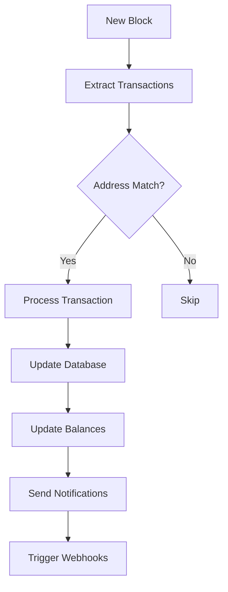

# Transactions

This guide covers transaction processing, monitoring, and management within the Crypto Payment Gateway.

## Transaction Lifecycle

### 1. Transaction Detection
When a transaction is sent to a monitored address:
- **Block Scanner** detects the transaction
- **Initial Status**: `pending`
- **Confirmations**: 0
- **Balance Update**: Added to unconfirmed balance

### 2. Confirmation Process
As blocks are mined:
- **Confirmation Count** increases with each new block
- **Status Updates** based on confirmation thresholds
- **Balance Migration** from unconfirmed to confirmed

### 3. Final Confirmation
When required confirmations are reached:
- **Status**: `confirmed`
- **Balance**: Fully available
- **Notifications**: Webhooks triggered

## Transaction Types

### Incoming Transactions (Deposits)
Transactions received by gateway-controlled addresses:

```json
{
  "id": "tx_123456789",
  "hash": "0xabc123...",
  "type": "incoming",
  "status": "confirmed",
  "network": "ethereum",
  "coin": "usdt",
  "amount": "100.50",
  "fee": "0.001",
  "from_address": "0x123...",
  "to_address": "0x456...",
  "confirmations": 15,
  "block_number": 18500000,
  "created_at": "2024-01-15T12:30:00Z",
  "confirmed_at": "2024-01-15T12:35:00Z"
}
```

### Outgoing Transactions (Withdrawals)
Transactions sent from gateway-controlled addresses:

```json
{
  "id": "tx_987654321",
  "hash": "0xdef456...",
  "type": "outgoing",
  "status": "confirmed",
  "network": "ethereum",
  "coin": "usdt",
  "amount": "50.00",
  "fee": "0.002",
  "from_address": "0x456...",
  "to_address": "0x789...",
  "confirmations": 12,
  "block_number": 18500010,
  "created_at": "2024-01-15T13:00:00Z",
  "confirmed_at": "2024-01-15T13:05:00Z"
}
```

### Internal Transactions
Transactions between gateway-controlled addresses:

```json
{
  "id": "tx_555666777",
  "hash": "0x789abc...",
  "type": "internal",
  "status": "confirmed",
  "network": "ethereum",
  "coin": "usdt",
  "amount": "25.00",
  "fee": "0.001",
  "from_address": "0x111...",
  "to_address": "0x222...",
  "purpose": "collection",
  "confirmations": 12
}
```

## Transaction Status

### Status Types

| Status | Description | Confirmations |
|--------|-------------|---------------|
| `pending` | Detected but unconfirmed | 0 |
| `confirming` | Partially confirmed | 1 to threshold-1 |
| `confirmed` | Fully confirmed | >= threshold |
| `failed` | Transaction failed | N/A |
| `replaced` | Replaced by another tx | N/A |

### Confirmation Requirements

| Network | Required Confirmations |
|---------|----------------------|
| Bitcoin | 6 |
| Ethereum | 12 |
| Tron | 19 |
| BSC | 15 |
| Polygon | 20 |
| Arbitrum | 10 |
| Fantom | 12 |
| Litecoin | 6 |

## Transaction Monitoring

### Real-time Tracking

The gateway continuously monitors:
- **New Transactions**: Detected in mempool or blocks
- **Confirmation Updates**: Block confirmations
- **Status Changes**: Pending → Confirming → Confirmed
- **Failed Transactions**: Reverted or dropped

### Block Scanning Process



## API Endpoints

### Get Transactions

```http
GET /api/v1/transactions
```

**Parameters:**
- `page`: Page number (default: 1)
- `limit`: Items per page (default: 20, max: 100)
- `address_id`: Filter by address
- `network`: Filter by network
- `coin`: Filter by coin
- `type`: Filter by type (incoming, outgoing, internal)
- `status`: Filter by status
- `from_date`: Start date (ISO 8601)
- `to_date`: End date (ISO 8601)

**Example:**
```bash
curl -X GET "https://api.gateway.com/v1/transactions?network=ethereum&coin=usdt&status=confirmed&limit=50" \
  -H "Authorization: Bearer YOUR_API_KEY"
```

### Get Transaction Details

```http
GET /api/v1/transactions/{id}
```

**Response:**
```json
{
  "success": true,
  "data": {
    "id": "tx_123456789",
    "hash": "0xabc123...",
    "type": "incoming",
    "status": "confirmed",
    "network": "ethereum",
    "coin": "usdt",
    "amount": "100.50",
    "fee": "0.001",
    "from_address": "0x123...",
    "to_address": "0x456...",
    "confirmations": 15,
    "block_number": 18500000,
    "block_hash": "0xblock123...",
    "transaction_index": 45,
    "gas_used": "21000",
    "gas_price": "20000000000",
    "nonce": 123,
    "metadata": {
      "customer_id": "cust_123",
      "order_id": "order_456"
    },
    "created_at": "2024-01-15T12:30:00Z",
    "confirmed_at": "2024-01-15T12:35:00Z"
  }
}
```

### Transaction History by Address

```http
GET /api/v1/addresses/{address_id}/transactions
```

## Transaction Fees

### Fee Calculation

#### Ethereum-based Networks
```javascript
// EIP-1559 fee structure
const fee = (baseFee + priorityFee) * gasUsed;

// Legacy fee structure
const fee = gasPrice * gasUsed;
```

#### Bitcoin-based Networks
```javascript
// Fee per byte
const fee = transactionSize * feePerByte;

// UTXO-based calculation
const fee = (inputs.length * 148 + outputs.length * 34 + 10) * feePerByte;
```

### Fee Optimization

#### Dynamic Fee Adjustment
- Monitor network congestion
- Adjust fees based on priority
- Use historical data for estimation
- Implement fee bumping for stuck transactions

#### Batch Processing
- Combine multiple operations
- Reduce per-transaction overhead
- Optimize UTXO usage
- Schedule during low-fee periods

## Error Handling

### Common Transaction Errors

#### Insufficient Funds
```json
{
  "error": {
    "code": "INSUFFICIENT_FUNDS",
    "message": "Insufficient balance for transaction",
    "details": {
      "required": "100.50",
      "available": "95.25",
      "coin": "usdt"
    }
  }
}
```

#### Gas Estimation Failed
```json
{
  "error": {
    "code": "GAS_ESTIMATION_FAILED",
    "message": "Unable to estimate gas for transaction",
    "details": {
      "reason": "execution_reverted",
      "data": "0x..."
    }
  }
}
```

#### Nonce Too Low
```json
{
  "error": {
    "code": "NONCE_TOO_LOW",
    "message": "Transaction nonce is too low",
    "details": {
      "provided": 123,
      "expected": 125
    }
  }
}
```

### Error Recovery

#### Automatic Retry
- Retry failed transactions with adjusted parameters
- Implement exponential backoff
- Maximum retry attempts
- Alert on persistent failures

#### Manual Intervention
- Review failed transactions
- Adjust gas/fee parameters
- Resubmit with corrections
- Cancel stuck transactions

## Webhook Notifications

### Transaction Events

#### Transaction Detected
```json
{
  "event": "transaction.detected",
  "data": {
    "id": "tx_123456789",
    "hash": "0xabc123...",
    "type": "incoming",
    "status": "pending",
    "amount": "100.50",
    "coin": "usdt",
    "network": "ethereum",
    "address": "0x456...",
    "confirmations": 0
  },
  "timestamp": "2024-01-15T12:30:00Z"
}
```

#### Transaction Confirmed
```json
{
  "event": "transaction.confirmed",
  "data": {
    "id": "tx_123456789",
    "hash": "0xabc123...",
    "type": "incoming",
    "status": "confirmed",
    "amount": "100.50",
    "coin": "usdt",
    "network": "ethereum",
    "address": "0x456...",
    "confirmations": 12,
    "block_number": 18500000
  },
  "timestamp": "2024-01-15T12:35:00Z"
}
```

## Best Practices

### Transaction Monitoring
1. **Set Appropriate Confirmation Thresholds**
   - Higher for larger amounts
   - Consider network security
   - Balance speed vs security

2. **Implement Proper Error Handling**
   - Retry mechanisms
   - Fallback strategies
   - User notifications

3. **Monitor Transaction Pools**
   - Track pending transactions
   - Detect stuck transactions
   - Implement fee bumping

### Performance Optimization
1. **Efficient Database Queries**
   - Index on hash, address, block number
   - Paginate large result sets
   - Cache frequently accessed data

2. **Batch Processing**
   - Group similar operations
   - Reduce API calls
   - Optimize database writes

3. **Real-time Updates**
   - Use WebSocket connections
   - Implement proper caching
   - Minimize polling frequency

### Security Considerations
1. **Transaction Validation**
   - Verify transaction signatures
   - Check for double-spending
   - Validate amounts and addresses

2. **Monitoring and Alerts**
   - Large transaction alerts
   - Unusual pattern detection
   - Failed transaction monitoring

3. **Data Integrity**
   - Regular balance reconciliation
   - Transaction audit trails
   - Backup and recovery procedures

This comprehensive guide covers all aspects of transaction processing within the Crypto Payment Gateway, ensuring reliable and secure handling of cryptocurrency transactions. 