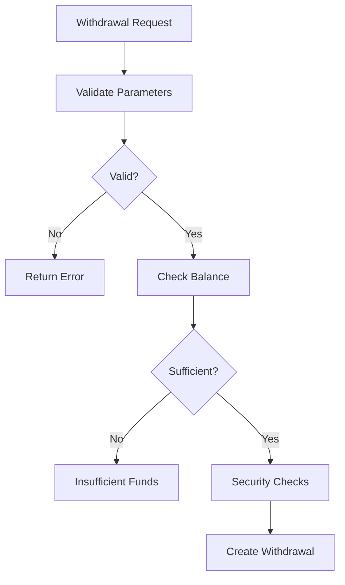
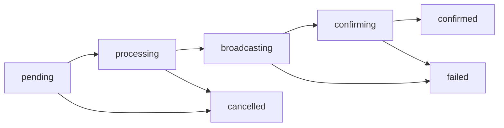

# Withdrawals

This guide covers the withdrawal system for sending cryptocurrency from gateway-controlled addresses to external destinations.

## Overview

The withdrawal system enables secure transfer of funds from hot wallets to external addresses with comprehensive validation, fee management, and security controls.

## Withdrawal Types

### Manual Withdrawals
Initiated by API requests or admin interface:
- **User-initiated**: Customer withdrawal requests
- **Admin-initiated**: Manual transfers by administrators
- **Scheduled**: Pre-configured recurring transfers

### Automatic Withdrawals
System-initiated transfers:
- **Collection**: Moving funds from user addresses to hot wallets
- **Consolidation**: Combining small UTXOs or balances
- **Rebalancing**: Maintaining optimal wallet distributions

## Withdrawal Process

### 1. Request Validation


### 2. Security Verification
- **Address Validation**: Verify destination address format
- **Amount Limits**: Check against daily/monthly limits
- **Whitelist Check**: Verify destination is approved
- **Multi-signature**: Require additional approvals if configured
- **Risk Assessment**: Evaluate transaction risk score

### 3. Transaction Creation
- **Fee Estimation**: Calculate optimal network fees
- **UTXO Selection**: Choose appropriate inputs (Bitcoin-based)
- **Gas Estimation**: Estimate gas requirements (Ethereum-based)
- **Nonce Management**: Handle transaction ordering
- **Transaction Signing**: Sign with appropriate private keys

### 4. Broadcasting
- **Network Submission**: Broadcast to blockchain network
- **Confirmation Tracking**: Monitor transaction status
- **Error Handling**: Retry failed broadcasts
- **Status Updates**: Update withdrawal status

## API Endpoints

### Create Withdrawal

```http
POST /api/v1/withdrawals
```

**Request Body:**
```json
{
  "network": "ethereum",
  "coin": "usdt",
  "amount": "100.50",
  "to_address": "0x742d35Cc6634C0532925a3b8D4C9db96590c6C87",
  "from_address_id": "addr_123456",
  "priority": "normal",
  "metadata": {
    "customer_id": "cust_789",
    "order_id": "order_456"
  }
}
```

**Response:**
```json
{
  "success": true,
  "data": {
    "id": "withdrawal_123456789",
    "status": "pending",
    "network": "ethereum",
    "coin": "usdt",
    "amount": "100.50",
    "fee": "0.002",
    "to_address": "0x742d35Cc6634C0532925a3b8D4C9db96590c6C87",
    "from_address": "0x456...",
    "estimated_confirmation_time": "2024-01-15T12:35:00Z",
    "created_at": "2024-01-15T12:30:00Z"
  }
}
```

### Get Withdrawal Status

```http
GET /api/v1/withdrawals/{id}
```

**Response:**
```json
{
  "success": true,
  "data": {
    "id": "withdrawal_123456789",
    "status": "confirmed",
    "network": "ethereum",
    "coin": "usdt",
    "amount": "100.50",
    "fee": "0.002",
    "to_address": "0x742d35Cc6634C0532925a3b8D4C9db96590c6C87",
    "from_address": "0x456...",
    "transaction_hash": "0xabc123...",
    "confirmations": 15,
    "block_number": 18500000,
    "created_at": "2024-01-15T12:30:00Z",
    "confirmed_at": "2024-01-15T12:35:00Z"
  }
}
```

### List Withdrawals

```http
GET /api/v1/withdrawals
```

**Parameters:**
- `page`: Page number (default: 1)
- `limit`: Items per page (default: 20, max: 100)
- `status`: Filter by status
- `network`: Filter by network
- `coin`: Filter by coin
- `from_date`: Start date (ISO 8601)
- `to_date`: End date (ISO 8601)

### Cancel Withdrawal

```http
DELETE /api/v1/withdrawals/{id}
```

**Note**: Only pending withdrawals can be cancelled.

## Withdrawal Status

### Status Flow


### Status Descriptions

| Status | Description |
|--------|-------------|
| `pending` | Withdrawal created, awaiting processing |
| `processing` | Validating and preparing transaction |
| `broadcasting` | Submitting transaction to network |
| `confirming` | Transaction broadcast, awaiting confirmations |
| `confirmed` | Transaction confirmed on blockchain |
| `failed` | Transaction failed or rejected |
| `cancelled` | Withdrawal cancelled before processing |

## Fee Management

### Fee Calculation

#### Dynamic Fee Estimation
```javascript
// Ethereum-based networks
const estimatedGas = await web3.eth.estimateGas(transaction);
const gasPrice = await web3.eth.getGasPrice();
const fee = estimatedGas * gasPrice;

// Bitcoin-based networks
const feeRate = await getFeeRate('normal'); // sat/byte
const txSize = calculateTransactionSize(inputs, outputs);
const fee = txSize * feeRate;
```

#### Fee Priority Levels

| Priority | Description | Fee Multiplier | Confirmation Time |
|----------|-------------|----------------|-------------------|
| `low` | Economy rate | 0.8x | 30-60 minutes |
| `normal` | Standard rate | 1.0x | 10-30 minutes |
| `high` | Fast rate | 1.5x | 5-15 minutes |
| `urgent` | Priority rate | 2.0x | 1-10 minutes |

### Fee Optimization

#### Batch Withdrawals
Combine multiple withdrawals into single transactions:
```json
{
  "batch_withdrawal": {
    "network": "ethereum",
    "coin": "usdt",
    "outputs": [
      {
        "to_address": "0x123...",
        "amount": "50.00"
      },
      {
        "to_address": "0x456...",
        "amount": "75.25"
      }
    ],
    "priority": "normal"
  }
}
```

#### UTXO Consolidation
For Bitcoin-based networks:
- Combine small UTXOs during low-fee periods
- Reduce future transaction sizes
- Optimize wallet efficiency

## Security Features

### Address Whitelisting

#### Add Whitelist Address
```http
POST /api/v1/whitelist/addresses
```

```json
{
  "address": "0x742d35Cc6634C0532925a3b8D4C9db96590c6C87",
  "network": "ethereum",
  "label": "Customer Wallet",
  "daily_limit": "1000.00",
  "monthly_limit": "10000.00"
}
```

#### Whitelist Validation
All withdrawals are checked against the whitelist:
- **Exact Match**: Address must be pre-approved
- **Limit Enforcement**: Respect daily/monthly limits
- **Automatic Approval**: Whitelisted addresses bypass manual review

### Multi-Signature Requirements

#### Configuration
```json
{
  "multisig_config": {
    "enabled": true,
    "required_signatures": 2,
    "total_signers": 3,
    "threshold_amount": "1000.00",
    "signers": [
      {
        "id": "signer_1",
        "public_key": "0x...",
        "role": "admin"
      },
      {
        "id": "signer_2",
        "public_key": "0x...",
        "role": "finance"
      },
      {
        "id": "signer_3",
        "public_key": "0x...",
        "role": "security"
      }
    ]
  }
}
```

#### Approval Process
For withdrawals exceeding threshold:
1. **Initial Request**: Creates pending withdrawal
2. **Signature Collection**: Gather required signatures
3. **Validation**: Verify all signatures
4. **Execution**: Process approved withdrawal

### Risk Assessment

#### Risk Factors
- **Amount Size**: Large withdrawals increase risk score
- **Destination**: New or suspicious addresses
- **Frequency**: Unusual withdrawal patterns
- **Geographic**: Requests from high-risk locations
- **Behavioral**: Deviation from normal patterns

#### Risk Scoring
```javascript
const riskScore = calculateRisk({
  amount: withdrawal.amount,
  destination: withdrawal.to_address,
  frequency: getUserWithdrawalFrequency(userId),
  location: request.ip_location,
  behavior: getUserBehaviorScore(userId)
});

if (riskScore > RISK_THRESHOLD) {
  // Require additional verification
  requireManualReview(withdrawal);
}
```

## Error Handling

### Common Errors

#### Insufficient Balance
```json
{
  "error": {
    "code": "INSUFFICIENT_BALANCE",
    "message": "Insufficient balance for withdrawal",
    "details": {
      "requested": "100.50",
      "available": "95.25",
      "coin": "usdt"
    }
  }
}
```

#### Invalid Address
```json
{
  "error": {
    "code": "INVALID_ADDRESS",
    "message": "Invalid destination address",
    "details": {
      "address": "invalid_address",
      "network": "ethereum"
    }
  }
}
```

#### Daily Limit Exceeded
```json
{
  "error": {
    "code": "DAILY_LIMIT_EXCEEDED",
    "message": "Daily withdrawal limit exceeded",
    "details": {
      "limit": "5000.00",
      "used": "4500.00",
      "requested": "1000.00",
      "available": "500.00"
    }
  }
}
```

### Error Recovery

#### Automatic Retry
- **Network Errors**: Retry with exponential backoff
- **Nonce Conflicts**: Adjust nonce and retry
- **Gas Estimation**: Increase gas limit and retry
- **Fee Issues**: Adjust fee and resubmit

#### Manual Intervention
- **Review Failed Withdrawals**: Admin dashboard
- **Adjust Parameters**: Modify gas/fee settings
- **Reprocess**: Manually trigger retry
- **Refund**: Return funds if unrecoverable

## Monitoring and Alerts

### Real-time Monitoring

#### Withdrawal Metrics
- **Processing Time**: Average time from request to confirmation
- **Success Rate**: Percentage of successful withdrawals
- **Fee Efficiency**: Average fees paid vs estimated
- **Queue Length**: Number of pending withdrawals

#### Alert Conditions
- **Large Withdrawals**: Amounts exceeding thresholds
- **Failed Transactions**: Multiple consecutive failures
- **Unusual Patterns**: Abnormal withdrawal behavior
- **System Issues**: Processing delays or errors

### Webhook Notifications

#### Withdrawal Status Updates
```json
{
  "event": "withdrawal.status_changed",
  "data": {
    "id": "withdrawal_123456789",
    "status": "confirmed",
    "previous_status": "confirming",
    "transaction_hash": "0xabc123...",
    "confirmations": 12
  },
  "timestamp": "2024-01-15T12:35:00Z"
}
```

## Best Practices

### Security
1. **Implement Multi-layered Validation**
   - Address format validation
   - Whitelist verification
   - Amount limit checks
   - Risk assessment

2. **Use Appropriate Confirmation Requirements**
   - Higher confirmations for larger amounts
   - Network-specific requirements
   - Risk-based adjustments

3. **Monitor for Suspicious Activity**
   - Unusual withdrawal patterns
   - Geographic anomalies
   - Rapid successive withdrawals

### Performance
1. **Optimize Fee Management**
   - Dynamic fee calculation
   - Batch processing when possible
   - Schedule during low-fee periods

2. **Efficient UTXO Management**
   - Regular consolidation
   - Optimal input selection
   - Minimize transaction sizes

3. **Queue Management**
   - Priority-based processing
   - Parallel processing where safe
   - Load balancing across hot wallets

### Operational
1. **Maintain Adequate Hot Wallet Balances**
   - Monitor balance levels
   - Automatic rebalancing
   - Emergency funding procedures

2. **Regular Security Audits**
   - Review withdrawal patterns
   - Validate security controls
   - Update risk parameters

3. **Comprehensive Logging**
   - All withdrawal requests
   - Security decisions
   - Error conditions
   - Performance metrics

This comprehensive guide covers all aspects of the withdrawal system, ensuring secure and efficient processing of cryptocurrency withdrawals while maintaining proper security controls and monitoring. 