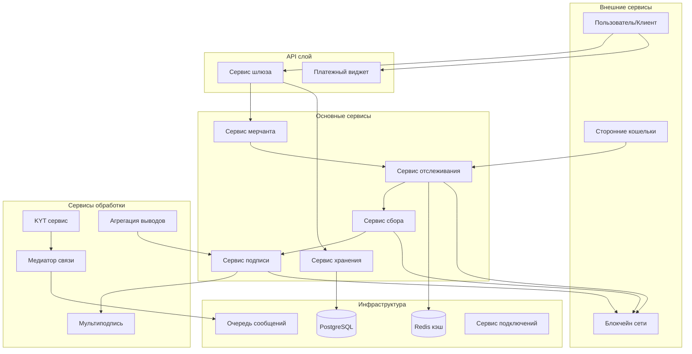

# Обзор архитектуры

Криптоплатежный шлюз построен на основе микросервисной архитектуры с модульными компонентами, которые обрабатывают различные аспекты обработки криптовалютных платежей.

## Архитектура системы

## Основные компоненты

### Приложения (`/apps`)

#### Сервис шлюза (Gateway)
- **Назначение**: Основная точка API для внешних интеграций
- **Обязанности**: 
  - REST API эндпоинты
  - Валидация и маршрутизация запросов
  - Аутентификация и авторизация
  - Ограничение скорости запросов

#### Сервис мерчанта (Merchant)
- **Назначение**: Бизнес-логика для операций мерчанта
- **Обязанности**:
  - Управление аккаунтами мерчантов
  - Логика обработки платежей
  - Расчет балансов
  - История транзакций

#### Сервис хранения (Storage)
- **Назначение**: Сохранение и извлечение данных
- **Обязанности**:
  - Операции с базой данных
  - Валидация данных
  - Логирование транзакций
  - Обновление балансов

#### Сервис отслеживания (Tracking)
- **Назначение**: Мониторинг блокчейн транзакций
- **Обязанности**:
  - Сканирование блоков
  - Обнаружение транзакций
  - Мониторинг адресов
  - Генерация событий

#### Сервис сбора (Collector)
- **Назначение**: Сбор токенов с пользовательских адресов
- **Обязанности**:
  - Сбор токенов
  - Управление комиссиями за газ
  - Планирование сбора
  - Координация мультиподписи

#### Сервис подписи (Signer)
- **Назначение**: Подпись и отправка транзакций
- **Обязанности**:
  - Управление приватными ключами
  - Подпись транзакций
  - Координация отправки
  - Валидация безопасности

#### Сервис мультиподписи (Multisig)
- **Назначение**: Операции с мультиподписными кошельками
- **Обязанности**:
  - Создание мультиподписных транзакций
  - Сбор подписей
  - Валидация порога
  - Обеспечение безопасности

#### KYT (Know Your Transaction)
- **Назначение**: Соответствие требованиям и мониторинг транзакций
- **Обязанности**:
  - Соответствие AML/KYC
  - Оценка рисков
  - Обнаружение подозрительной активности
  - Регуляторная отчетность

#### Агрегация выводов (Withdrawal Aggregation)
- **Назначение**: Оптимизированные пакетные выводы
- **Обязанности**:
  - Пакетирование выводов
  - Оптимизация комиссий
  - Координация времени
  - Управление статусами

#### Медиатор связи (Communication Mediator)
- **Назначение**: Межсервисная коммуникация
- **Обязанности**:
  - Маршрутизация сообщений
  - Распределение событий
  - Координация сервисов
  - Обработка ошибок

#### Сервис подключений (Connection Service)
- **Назначение**: Подключения к внешним сервисам
- **Обязанности**:
  - RPC подключения
  - Пулинг соединений
  - Обработка отказов
  - Мониторинг здоровья

#### Виджет (Widget)
- **Назначение**: Фронтенд интерфейс платежей
- **Обязанности**:
  - UI платежей
  - Генерация QR кодов
  - Обновления статуса
  - Взаимодействие с пользователем

### Пакеты (`/packages`)

#### Блокчейн клиенты
- **bc-client**: Общий интерфейс блокчейн клиента
- **bc-client-provider**: Фабрика провайдеров клиентов
- **bitcoin**: Операции специфичные для Bitcoin
- **ether**: Операции совместимые с Ethereum
- **tron**: Операции сети Tron

#### Инфраструктура
- **amqp**: Сообщения RabbitMQ
- **cache-manager**: Кэширование Redis
- **config**: Управление конфигурацией
- **logger**: Утилиты логирования
- **typeorm**: Расширения ORM базы данных

#### Бизнес-логика
- **addresses**: Управление адресами
- **currency-rates**: Обработка курсов валют
- **distributor**: Распределение средств
- **payer**: Обработка платежей
- **tracker**: Отслеживание транзакций

#### Утилиты
- **common**: Общие утилиты
- **encoder**: Кодирование/декодирование данных
- **helpers**: Вспомогательные функции
- **http-client**: Утилиты HTTP клиента
- **io-emitter**: Генерация событий
- **provider**: Провайдеры сервисов
- **rpc**: RPC коммуникация
- **testing**: Утилиты тестирования

## Поток данных

### Поток депозитов
1. Пользователь отправляет криптовалюту на сгенерированный адрес
2. **Сервис отслеживания** обнаруживает входящую транзакцию
3. **Сервис хранения** обновляет записи балансов
4. **Сервис сбора** собирает токены в кошелек сбора
5. **Сервис мерчанта** обрабатывает бизнес-логику
6. **Медиатор связи** отправляет уведомления

### Поток выводов
1. **Шлюз** получает запрос на вывод
2. **Сервис мерчанта** валидирует запрос и баланс
3. **Агрегация выводов** группирует запросы (если включено)
4. **Сервис подписи** создает и подписывает транзакцию
5. **Сервис мультиподписи** обрабатывает требования мультиподписи
6. **Сервис хранения** обновляет балансы и статус
7. **Медиатор связи** отправляет подтверждение

## Типы адресов и владение

### Пользовательские адреса (по умолчанию)
- **Назначение**: Получение депозитов от пользователей
- **Управление ключами**: Шлюз контролирует приватные ключи
- **Использование**: Основные адреса для депозитов

### Горячие кошельки (тип `hot`)
- **Назначение**: Источник для выводов пользователям
- **Управление ключами**: Шлюз контролирует приватные ключи
- **Требования**: Должен поддерживать баланс нативной монеты для комиссий за газ

### Холодные кошельки (тип `cold`)
- **Назначение**: Место назначения для долгосрочного хранения
- **Управление ключами**: Шлюз НЕ контролирует приватные ключи
- **Использование**: Безопасное хранение собранных средств

### Сборщики токенов (тип `tokens_collector`)
- **Назначение**: Промежуточный сбор токенов
- **Управление ключами**: Шлюз контролирует приватные ключи
- **Требования**: Должен поддерживать баланс нативной монеты для комиссий за газ

## Режимы адресов

### Одиночный режим (`ADDRESSES_MODE=single`)
- Один адрес на монету на сеть
- Требуется ручное создание адреса для каждой монеты
- Детальный контроль над распределением адресов

### Общий режим (`ADDRESSES_MODE=common`)
- Один адрес на сеть (все монеты)
- Автоматическое создание балансов для всех монет сети
- Упрощенное управление адресами

### Кросс режим (`ADDRESSES_MODE=cross`)
- Один адрес для совместимых сетей
- Максимальное переиспользование адресов
- Оптимально для EVM-совместимых цепей

## Режимы агрегации выводов

### Режим "Нет"
- Индивидуальные транзакции для каждого вывода
- Более высокие комиссии, но немедленная обработка
- Подходит для высокостоимостных, редких выводов

### Пакетный режим
- Несколько выводов в одной транзакции
- Оптимизированные комиссии через пакетирование
- Настраиваемый размер пакета и время
- Идеально для частых, небольших выводов

## Архитектура безопасности

### Многоуровневая безопасность
1. **API слой**: Аутентификация, ограничение скорости, валидация входных данных
2. **Сервисный слой**: Валидация бизнес-логики, авторизация
3. **Слой данных**: Зашифрованное хранение, аудит логирование
4. **Сетевой слой**: Безопасная коммуникация, поддержка VPN

### Управление ключами
- Поддержка аппаратного модуля безопасности (HSM)
- Интеграция мультиподписных кошельков
- Возможности ротации ключей
- Безопасная деривация ключей

### Мониторинг и соответствие
- Мониторинг транзакций в реальном времени
- Интеграция AML/KYC
- Обнаружение подозрительной активности
- Отчетность о соответствии регуляторным требованиям

## Функции масштабируемости

### Горизонтальное масштабирование
- Микросервисная архитектура
- Поддержка балансировщика нагрузки
- Возможности шардинга базы данных
- Оптимизация слоя кэша

### Оптимизация производительности
- Пулинг соединений
- Пакетная обработка
- Асинхронные операции
- Эффективные структуры данных

### Высокая доступность
- Избыточность сервисов
- Механизмы отказоустойчивости
- Мониторинг здоровья
- Плавная деградация 